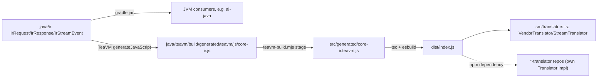

Canonical, vendor-neutral IR (internal representation) for the intisy AI-tooling
ecosystem. A genuine neutral schema, Java + TeaVM single-source, so the exact
same types compile to a JVM jar (for ai-java / the JVM router) **and** to a JS
module (for TS front-doors and providers) -- no duplicated TS reimplementation
of decisions that already live in Java.
core-ir ships zero vendor translators. Every vendor translator (Anthropic,
Gemini, OpenAI, and so on) lives in its own `*-translator` repo, which depends
on this one and re-exports its IR surface (`VendorTranslator`,
`StreamTranslator`) alongside its own translator implementing
`io.github.intisy.ai.ir.spi.Translator`.

## Under-the-Hood Architecture



## Structure

- `java/ir/` -- the neutral IR types (`IrRequest`, `IrMessage`, the `Block`
  hierarchy, `IrTool`, `IrToolChoice`, `IrThinking`, `IrUsage`, `IrResponse`,
  `IrStopReason`, and the streaming `IrStreamEvent` hierarchy under `stream/`)
  -- plain-field POJOs, TeaVM-transpilable (no reflection, Java 8
  source/target). `json/` holds the `JsonCodec` SPI (`spi/`) plus the
  hand-rolled `Map<String,Object>` <-> POJO conversion (`IrJson` facade +
  per-type `*Json` helpers). `spi/Translator`, `spi/StreamDecoder`, and
  `spi/StreamEncoder` are the contract each `*-translator` repo implements.
  `extensions` maps at request/message/block/response/event level carry
  lossless vendor-specific passthrough with no neutral home.
- `java/teavm/` -- the TeaVM JS export surface, `CoreIrJs`: bare smoke exports
  (`jsonRoundTrip`, `irRequestRoundTrip`, `irResponseRoundTrip`,
  `irStreamEventRoundTrip`) proving the neutral-IR pipeline is wired through
  TeaVM correctly. No vendor translator exports live here; each
  `*-translator` repo defines its own TeaVM export surface over its own
  `Translator` implementation.
- `java/settings.gradle` / `java/build.gradle` / `java/gradlew*` --
  self-contained Gradle build (Java 8 for `:ir`, Java 17 override for
  `:teavm`), copied from core-proxy's Java scaffolding.
- `teavm-build.mjs` -- generic gradle-TeaVM -> stable-ESM staging step (copied
  verbatim from core-proxy; app-agnostic).
- `src/generated/core-ir.teavm.d.ts` -- hand-authored ambient types for the
  staged JS (the `.js` itself is gitignored build output).
- `src/types.ts` -- the TS mirror of the IR/Block/StreamEvent shapes the Java
  `*Json` helpers produce and consume.
- `src/translators.ts` -- the `VendorTranslator`/`StreamTranslator` interfaces
  every `*-translator` repo implements: `decodeRequest`/`encodeRequest`/
  `decodeResponse`/`encodeResponse` plus `decodeStream()`/`encodeStream()`,
  which return a real `TransformStream`.
- `src/index.ts` -- the public barrel: `loadCoreIr()` (a lazily-memoized
  dynamic import of the TeaVM ESM) plus re-exports of `translators.ts` and
  `types.ts`.
- `src/__tests__/smoke.test.ts` -- neutral-IR round trips through the TeaVM
  module (JSON round trip, `IrRequest` round trip).

## Usage

Java (jar), implementing a vendor translator in its own repo:

```java
JsonCodec json = new SimpleJsonCodec(); // or any JsonCodec
Translator translator = new MyVendorTranslator(json);
IrRequest ir = translator.decodeRequest(wireJson);
String backToWire = translator.encodeRequest(ir);

StreamDecoder decoder = translator.newStreamDecoder();
for (String chunk : sseChunks) {
    for (IrStreamEvent event : decoder.decode(chunk)) { /* ... */ }
}
```

TS, consuming a `*-translator` repo's `VendorTranslator`:

```ts
import type { VendorTranslator } from "core-ir";
import { myVendorTranslator } from "my-vendor-translator";

const translator: VendorTranslator = myVendorTranslator;
const ir = await translator.decodeRequest(wireJson);
const backToWire = await translator.encodeRequest(ir);

const decodeStream = await translator.decodeStream();
const events = upstreamSseBody.pipeThrough(decodeStream); // ReadableStream<IrStreamEvent>
```

## IrUsage

`IrUsage` carries `inputTokens`/`outputTokens`/`cacheReadInputTokens`/
`cacheCreationInputTokens` plus `reasoningTokens`/`totalTokens`. The latter two
are populated only by vendors with a reasoning-token concept and a derived
total; vendors without one leave both `null`.

## Testing

Java: `cd java && ./gradlew test` (JUnit 5, `:ir` and `:teavm` modules --
neutral IR round trips only; vendor translator tests live in their own
`*-translator` repos).

TS: `npm run build && npx vitest run` (`build` stages the TeaVM JS, `tsc`s,
then bundles with esbuild; `test` round-trips the neutral IR types through
the TeaVM module).
