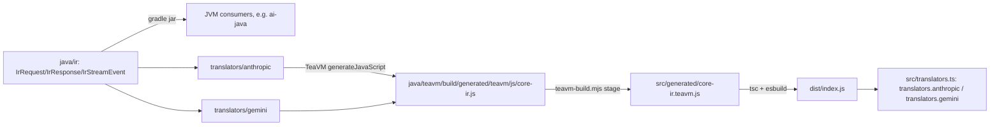

# core-ir

Canonical, vendor-neutral IR (internal representation) for the intisy AI-tooling
ecosystem, plus the Anthropic and Gemini translators that convert their wire
formats to/from it. A genuine neutral schema (not "adopting Anthropic"),
Java + TeaVM single-source, so the exact same types and translator logic
compile to a JVM jar (for ai-java / the JVM router) **and** to a JS module (for
TS front-doors and providers) — no duplicated TS reimplementation of decisions
that already live in Java.

This is **SP-1** of the canonical-IR design (see
`docs/superpowers/specs/2026-07-18-canonical-ir-design.md`): the IR types, both
vendor translators (request/response/streaming), and the full TeaVM export
surface. It is a **library only** — nothing is wired into providers/proxies
yet (that's SP-2+).

## Under-the-Hood Architecture



Each vendor translator implements `io.github.intisy.ai.ir.spi.Translator`:
`decodeRequest`/`encodeRequest`, `decodeResponse`/`encodeResponse`, and
stateful `newStreamDecoder()`/`newStreamEncoder()` for true streaming (no
buffer-and-reconvert). `AnthropicTranslator` is meant to be reused by both a
Claude-Code front-door (app wire &lt;-&gt; IR) and claude-code-auth (IR &lt;-&gt;
Anthropic upstream); `GeminiTranslator` serves antigravity's Gemini upstream.

## Structure

- `java/ir/` — the neutral IR types (`IrRequest`, `IrMessage`, the `Block`
  hierarchy, `IrTool`, `IrToolChoice`, `IrThinking`, `IrUsage`, `IrResponse`,
  `IrStopReason`, and the streaming `IrStreamEvent` hierarchy under `stream/`)
  — plain-field POJOs, TeaVM-transpilable (no reflection, Java 8
  source/target). `json/` holds the `JsonCodec` SPI (`spi/`) plus the
  hand-rolled `Map<String,Object>` &lt;-&gt; POJO conversion (`IrJson` facade +
  per-type `*Json` helpers). `translators/anthropic/` and
  `translators/gemini/` hold each vendor's request/response/stream codecs plus
  its `Translator` implementation. `extensions` maps at request/message/block/
  response/event level carry lossless vendor-specific passthrough (e.g.
  Anthropic `cache_control`, Gemini `safetySettings`).
- `java/teavm/` — the TeaVM JS export surface, `CoreIrJs`:
  - T1 smoke exports (`jsonRoundTrip`, `irRequestRoundTrip`,
    `irResponseRoundTrip`, `irStreamEventRoundTrip`) proving the pipeline.
  - Non-streaming translator exports: `anthropicDecodeRequest`/
    `anthropicEncodeRequest`/`anthropicDecodeResponse`/`anthropicEncodeResponse`,
    and the `gemini*` equivalents — plain `wireJson <-> irJson` string
    functions, one `Translator` instance per call (stateless).
  - Streaming translator exports: `anthropicNewStreamDecoder`/
    `anthropicNewStreamEncoder` and the `gemini*` equivalents — factory
    functions returning a stateful `JSObject` handle (`decode(chunk)`/
    `encode(irEventJson)`), mirroring antigravity-auth's proven
    `newStreamMapper`/`JsStreamMapperHandle` streaming-over-TeaVM pattern. All
    SSE line/frame buffering happens inside the Java `StreamDecoder` itself
    (a chunk may split mid-line; the decoder buffers across calls), so the JS
    handle is genuinely stateful per connection, not just a stateless mapper.
- `java/settings.gradle` / `java/build.gradle` / `java/gradlew*` —
  self-contained Gradle build (Java 8 for `:ir`, Java 17 override for
  `:teavm`), copied from core-proxy's Java scaffolding.
- `teavm-build.mjs` — generic gradle-TeaVM -> stable-ESM staging step (copied
  verbatim from core-proxy; app-agnostic).
- `src/generated/core-ir.teavm.d.ts` — hand-authored ambient types for the
  staged JS (the `.js` itself is gitignored build output).
- `src/types.ts` — the TS mirror of the IR/Block/StreamEvent shapes the Java
  `*Json` helpers produce and consume.
- `src/translators.ts` — the public, typed TS API: `translators.anthropic` /
  `translators.gemini`, each with `decodeRequest`/`encodeRequest`/
  `decodeResponse`/`encodeResponse` (thin async wrappers over the TeaVM
  exports) and `decodeStream()`/`encodeStream()`, which return a real
  `TransformStream` driven chunk-by-chunk by the stateful Java handle.
- `src/index.ts` — the public barrel: `loadCoreIr()` (a lazily-memoized
  dynamic import of the TeaVM ESM) plus re-exports of `translators.ts` and
  `types.ts`.
- `src/__tests__/` — `smoke.test.ts` (T1 round trips) and
  `translators.test.ts` (Anthropic + Gemini request round trips, and a full
  streamed-response round trip through the `TransformStream` helpers).

## Usage

Java (jar):

```java
JsonCodec json = new SimpleJsonCodec(); // or any JsonCodec
Translator anthropic = new AnthropicTranslator(json);
IrRequest ir = anthropic.decodeRequest(wireJson);
String backToWire = anthropic.encodeRequest(ir);

StreamDecoder decoder = anthropic.newStreamDecoder();
for (String chunk : sseChunks) {
    for (IrStreamEvent event : decoder.decode(chunk)) { /* ... */ }
}
```

TS (generated JS via TeaVM):

```ts
import { translators } from "core-ir";

const ir = await translators.anthropic.decodeRequest(wireJson);
const backToWire = await translators.anthropic.encodeRequest(ir);

const decodeStream = await translators.gemini.decodeStream();
const events = upstreamSseBody.pipeThrough(decodeStream); // ReadableStream<IrStreamEvent>
```

## IrUsage

`IrUsage` carries `inputTokens`/`outputTokens`/`cacheReadInputTokens`/
`cacheCreationInputTokens` plus `reasoningTokens`/`totalTokens`. The latter two
map onto Gemini's `usageMetadata.thoughtsTokenCount`/`totalTokenCount`
directly (no `extensions` workaround); Anthropic has no reasoning-token count
or derived total, so both stay `null` for that translator.

## Testing

Java: `cd java && ./gradlew test` (JUnit 5, `:ir` and `:teavm` modules —
golden-vector request/response/stream round trips for both vendors, plus a
cross-vendor Anthropic-&gt;IR-&gt;Gemini test).

TS: `npm run build && npx vitest run` (`build` stages the TeaVM JS, `tsc`s,
then bundles with esbuild; `test` round-trips both translators from TS,
including a full streamed response through the `TransformStream` helpers).

## License

MIT
