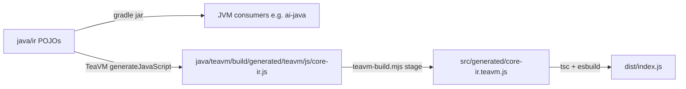

# core-ir

Canonical, vendor-neutral IR (internal representation) for the intisy AI-tooling
ecosystem. A genuine neutral schema (not "adopting Anthropic"), Java + TeaVM
single-source, so the same types compile to a JVM jar (for ai-java / the JVM
router) and to a JS module (for TS front-doors and providers).

This is the **foundation** (T1 / SP-1): IR types + JSON (de)serialize helper +
TeaVM export, proven building end to end. **No translators yet** -- vendor
translators (Anthropic/Gemini/...) land in later sub-projects, per the
canonical IR design doc's decomposition.

## Under-the-Hood Architecture

## Structure

- `java/ir/` -- neutral IR types: `IrRequest`, `IrMessage`, the `Block`
  hierarchy (`TextBlock`/`ImageBlock`/`ToolUseBlock`/`ToolResultBlock`/
  `ThinkingBlock`), `IrTool`, `IrToolChoice`, `IrThinking`, `IrUsage`,
  `IrResponse`, `IrStopReason`, and the streaming `IrStreamEvent` hierarchy
  (`stream/` subpackage) -- plain-fields POJOs, TeaVM-transpilable (no
  reflection, Java 8 source/target). `json/` holds the `JsonCodec` SPI (in
  `spi/`) plus the hand-rolled `Map<String,Object>` <-> POJO conversion
  (`IrJson` facade + per-type `*Json` helpers), mirroring core-proxy/routing's
  `JsonUtil` pattern. `extensions` maps at request/message/block/response
  level carry lossless vendor-specific passthrough.
- `java/teavm/` -- TeaVM JS export surface (`CoreIrJs`) over `:ir`, exporting
  round-trip smoke functions (`jsonRoundTrip`, `irRequestRoundTrip`,
  `irResponseRoundTrip`, `irStreamEventRoundTrip`) that prove the whole
  gradle+TeaVM pipeline; translator exports land here in later sub-projects.
- `java/settings.gradle` / `java/build.gradle` / `java/gradlew*` -- self-
  contained Gradle build (Java 8 for `:ir`, Java 17 override for `:teavm`),
  copied from core-proxy's Java scaffolding.
- `teavm-build.mjs` -- generic gradle-TeaVM -> stable-ESM staging step
  (copied verbatim from core-proxy; app-agnostic).
- `src/generated/core-ir.teavm.d.ts` -- hand-authored ambient types for the
  staged JS (the `.js` itself is gitignored build output).
- `src/index.ts` -- the public barrel: `loadCoreIr()`, a lazily-memoized
  dynamic import of the TeaVM ESM.
- `src/__tests__/smoke.test.ts` -- proves the barrel loads and the Java-side
  round trips work from TS.

## Testing

Java: `cd java && ./gradlew test` (JUnit 5, `:ir` and `:teavm` modules).

TS: `npm run build && npm test` (`build` stages the TeaVM JS, `tsc`s, then
bundles with esbuild; `test` runs vitest against the built `src/generated`
output).

## License

MIT
