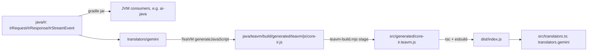

# core-ir

Canonical, vendor-neutral IR (internal representation) for the intisy AI-tooling
ecosystem, plus the Gemini translator that converts its wire format to/from
it. A genuine neutral schema, Java + TeaVM single-source, so the exact same
types and translator logic compile to a JVM jar (for ai-java / the JVM router)
**and** to a JS module (for TS front-doors and providers) — no duplicated TS
reimplementation of decisions that already live in Java.

Vendor translators for other wire formats (for example Anthropic) live in
their own `*-translator` repos, which nest this repo as a submodule and
re-export its IR surface alongside their own translator.

## Under-the-Hood Architecture


```mermaid
flowchart LR
  IR[java/ir: IrRequest/IrResponse/IrStreamEvent] -->|gradle jar| JVM[JVM consumers, e.g. ai-java]
  IR --> GEM[translators/gemini]
  GEM -->|TeaVM generateJavaScript| GEN[java/teavm/build/generated/teavm/js/core-ir.js]
  GEN -->|teavm-build.mjs stage| STAGED[src/generated/core-ir.teavm.js]
  STAGED -->|tsc + esbuild| DIST[dist/index.js]
  DIST --> API["src/translators.ts: translators.gemini"]
```

The Gemini translator implements `io.github.intisy.ai.ir.spi.Translator`:
`decodeRequest`/`encodeRequest`, `decodeResponse`/`encodeResponse`, and
stateful `newStreamDecoder()`/`newStreamEncoder()` for true streaming (no
buffer-and-reconvert). `GeminiTranslator` serves antigravity's Gemini
upstream.

## Structure

- `java/ir/` — the neutral IR types (`IrRequest`, `IrMessage`, the `Block`
  hierarchy, `IrTool`, `IrToolChoice`, `IrThinking`, `IrUsage`, `IrResponse`,
  `IrStopReason`, and the streaming `IrStreamEvent` hierarchy under `stream/`)
  — plain-field POJOs, TeaVM-transpilable (no reflection, Java 8
  source/target). `json/` holds the `JsonCodec` SPI (`spi/`) plus the
  hand-rolled `Map<String,Object>` &lt;-&gt; POJO conversion (`IrJson` facade +
  per-type `*Json` helpers). `translators/gemini/` holds the Gemini
  request/response/stream codecs plus its `Translator` implementation.
  `extensions` maps at request/message/block/response/event level carry
  lossless vendor-specific passthrough (e.g. Gemini `safetySettings`).
- `java/teavm/` — the TeaVM JS export surface, `CoreIrJs`:
  - Smoke exports (`jsonRoundTrip`, `irRequestRoundTrip`,
    `irResponseRoundTrip`, `irStreamEventRoundTrip`) proving the pipeline.
  - Non-streaming translator exports: `geminiDecodeRequest`/
    `geminiEncodeRequest`/`geminiDecodeResponse`/`geminiEncodeResponse` —
    plain `wireJson <-> irJson` string functions, one `Translator` instance
    per call (stateless).
  - Streaming translator exports: `geminiNewStreamDecoder`/
    `geminiNewStreamEncoder` — factory functions returning a stateful
    `JSObject` handle (`decode(chunk)`/`encode(irEventJson)`), mirroring
    antigravity-auth's proven `newStreamMapper`/`JsStreamMapperHandle`
    streaming-over-TeaVM pattern. All SSE line/frame buffering happens inside
    the Java `StreamDecoder` itself (a chunk may split mid-line; the decoder
    buffers across calls), so the JS handle is genuinely stateful per
    connection, not just a stateless mapper.
- `java/settings.gradle` / `java/build.gradle` / `java/gradlew*` —
  self-contained Gradle build (Java 8 for `:ir`, Java 17 override for
  `:teavm`), copied from core-proxy's Java scaffolding.
- `teavm-build.mjs` — generic gradle-TeaVM -> stable-ESM staging step (copied
  verbatim from core-proxy; app-agnostic).
- `src/generated/core-ir.teavm.d.ts` — hand-authored ambient types for the
  staged JS (the `.js` itself is gitignored build output).
- `src/types.ts` — the TS mirror of the IR/Block/StreamEvent shapes the Java
  `*Json` helpers produce and consume.
- `src/translators.ts` — the public, typed TS API: `translators.gemini`, with
  `decodeRequest`/`encodeRequest`/`decodeResponse`/`encodeResponse` (thin
  async wrappers over the TeaVM exports) and `decodeStream()`/`encodeStream()`,
  which return a real `TransformStream` driven chunk-by-chunk by the stateful
  Java handle.
- `src/index.ts` — the public barrel: `loadCoreIr()` (a lazily-memoized
  dynamic import of the TeaVM ESM) plus re-exports of `translators.ts` and
  `types.ts`.
- `src/__tests__/` — `smoke.test.ts` (round trips) and `translators.test.ts`
  (Gemini request/response round trips, and a full streamed-response round
  trip through the `TransformStream` helpers).

## Usage

Java (jar):

```java
JsonCodec json = new SimpleJsonCodec(); // or any JsonCodec
Translator gemini = new GeminiTranslator(json);
IrRequest ir = gemini.decodeRequest(wireJson);
String backToWire = gemini.encodeRequest(ir);

StreamDecoder decoder = gemini.newStreamDecoder();
for (String chunk : sseChunks) {
    for (IrStreamEvent event : decoder.decode(chunk)) { /* ... */ }
}
```

TS (generated JS via TeaVM):

```ts
import { translators } from "core-ir";

const ir = await translators.gemini.decodeRequest(wireJson);
const backToWire = await translators.gemini.encodeRequest(ir);

const decodeStream = await translators.gemini.decodeStream();
const events = upstreamSseBody.pipeThrough(decodeStream); // ReadableStream<IrStreamEvent>
```

## IrUsage

`IrUsage` carries `inputTokens`/`outputTokens`/`cacheReadInputTokens`/
`cacheCreationInputTokens` plus `reasoningTokens`/`totalTokens`. The latter two
map onto Gemini's `usageMetadata.thoughtsTokenCount`/`totalTokenCount`
directly (no `extensions` workaround); vendors with no reasoning-token concept
leave both `null`.

## Testing

Java: `cd java && ./gradlew test` (JUnit 5, `:ir` and `:teavm` modules —
golden-vector Gemini request/response/stream round trips, plus a
cross-vendor IR-&gt;Gemini test proving the canonical IR is a real
interchange).

TS: `npm run build && npx vitest run` (`build` stages the TeaVM JS, `tsc`s,
then bundles with esbuild; `test` round-trips the Gemini translator from TS,
including a full streamed response through the `TransformStream` helpers).

## License

MIT
